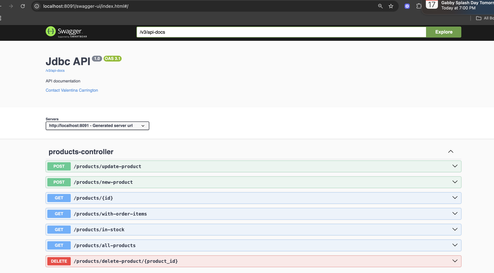
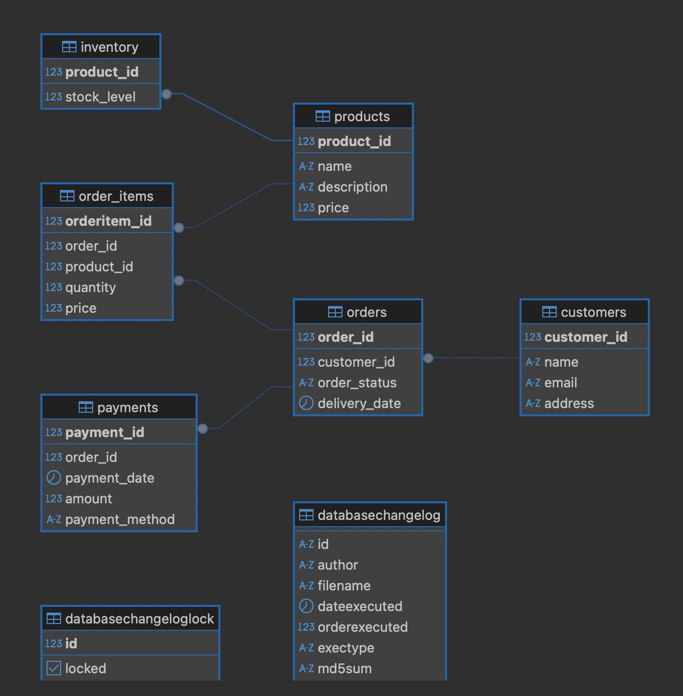

# Read Me First
This project is a demonstration how to use Java with PostgreSQL with JDBC and Liquibase

**JDBC (Java Database Connectivity)** is a Java API that enables Java applications to interact with relational databases. It provides methods for querying and updating data, as well as managing database connections, statements, and result sets.
* The project connects to PostgreSQL with Liquibase. 
* During testing, it connects to H2 in-memory database with test data to run unit tests.

# Getting Started

## Transactions/Rollbacks

When deleting a Customer that has related orders with payments, we use @Transactional annotation, which is used to execute a block of code within a database transaction. If any exception is thrown inside the block, the transaction is rolled back automatically; otherwise, it is committed. 
* See example: src/main/java/com/vcarrin87/jdbc_example/services/CustomerService.java #deleteCustomer()
* See example: src/main/java/com/vcarrin87/jdbc_example/services/OrdersService.java #deleteOrders()
* See example: src/main/java/com/vcarrin87/jdbc_example/services/ProductsService.java #deleteProduct()

### Swagger-UI

Swagger UI provides a web-based interface to visualize and interact with the API's endpoints.
To access Swagger UI:
1. Start the application server.
2. Open a web browser.
3. Navigate to the Swagger UI URL, typically in the format: `http://<server_address>:8091/swagger-ui/index.html`.
4. Use the interface to explore available API endpoints, view request/response schemas, and test API calls.



### Database ER Diagram


## Testing
### Run all tests
```bash
    ./mvnw test
```

### Run single test suite
```bash
    ./mvnw -Dtest=<Test_Name> test
```

### Run single test
```bash
    ./mvnw -Dtest=<Test_Name>#<method_name> test
```