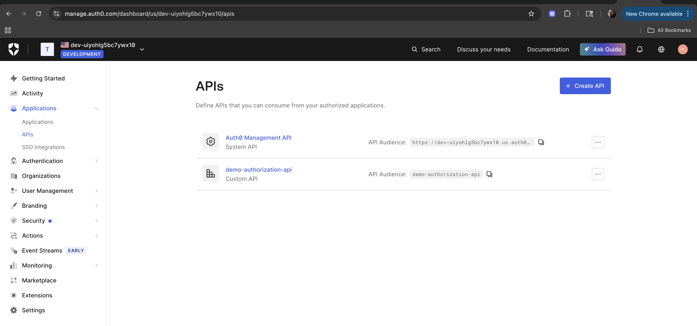
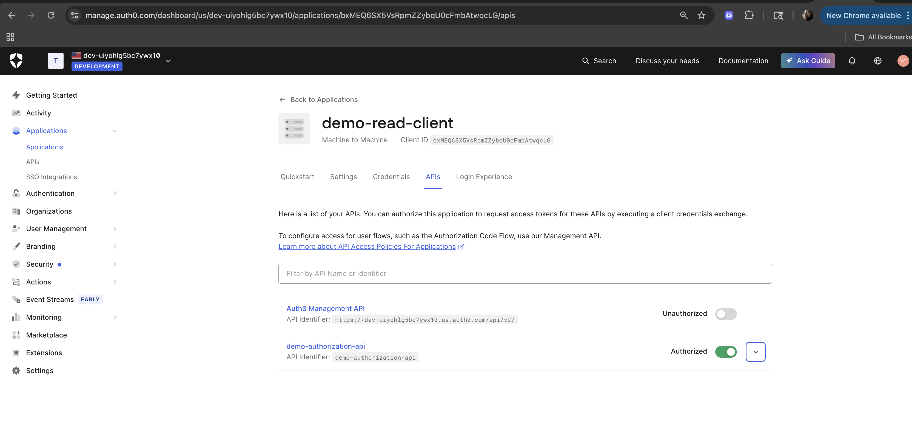
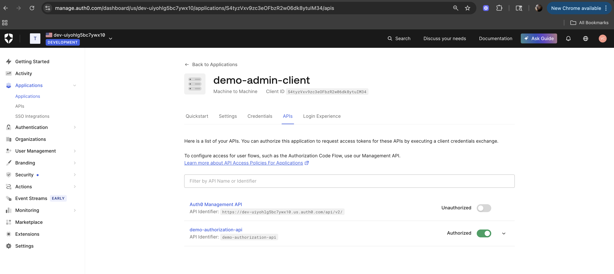
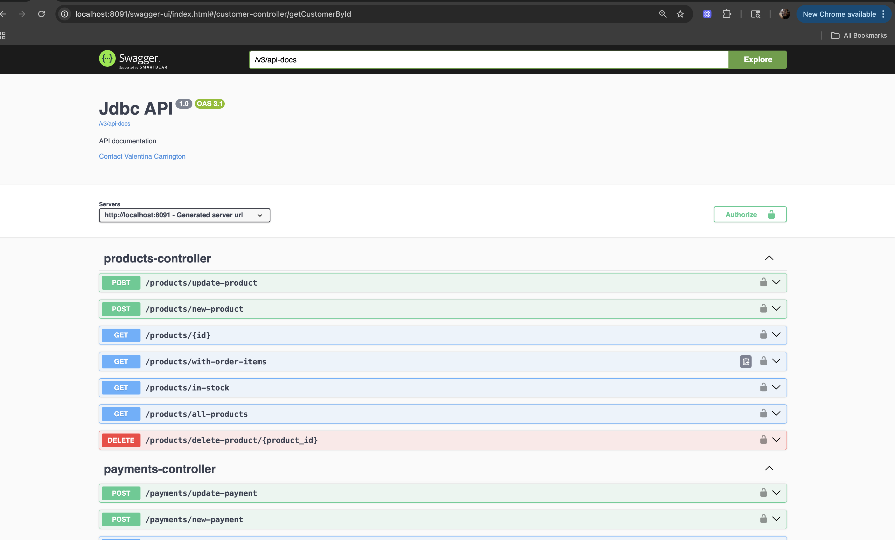
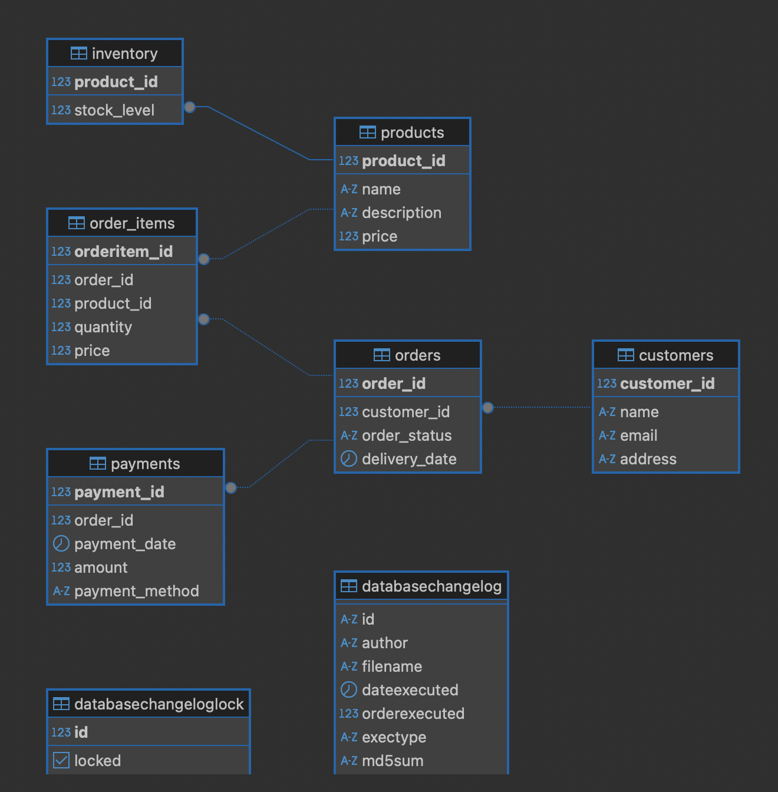

This project is a demonstration how to use Java with PostgreSQL with JDBC and Liquibase

**JDBC (Java Database Connectivity)** is a Java API that enables Java applications to interact with relational databases. It provides methods for querying and updating data, as well as managing database connections, statements, and result sets.
* The project connects to PostgreSQL with Liquibase. 
* During testing, it connects to H2 in-memory database with test data to run unit tests.

## Security with Auth0 Integration
This project uses Auth0 for Machine-to-Machine (M2M) authentication and authorization. Auth0 issues a JWT (JSON Web Token) to clients, which is then used to access protected API endpoints.

**How it works:**
1. The client application authenticates with Auth0 using its client credentials (client ID and secret).
2. Auth0 returns a JWT access token if the credentials are valid.
3. The client includes this JWT in the `Authorization: Bearer <token>` header of each API request.
4. The backend validates the JWT signature and claims (such as audience and issuer) to ensure the request is authenticated and authorized.

**Key points:**
- Only clients with valid Auth0 credentials can obtain a JWT and access the API.
- JWT tokens are validated on every request for authenticity and required scopes/roles.
- Sensitive endpoints are protected using security filters that check for valid JWTs.


**Example request:**
```http
GET /api/customers
Authorization: Bearer <your-jwt-token>
```

The following screenshots illustrate the different access levels provided by each client.

### Custom API


### Client with READ Access


### Client with ADMIN Access


## JdbcTemplate

JdbcTemplate is a core class in the Spring Framework that simplifies working with relational databases using JDBC. It handles common tasks such as:

* Opening and closing database connections
* Executing SQL queries and updates
* Handling exceptions and translating them into Spring's DataAccessException hierarchy
* Managing prepared statements and result sets

## Transactions/Rollbacks

When deleting a Customer that has related orders with payments, we use @Transactional annotation, which is used to execute a block of code within a database transaction. If any exception is thrown inside the block, the transaction is rolled back automatically; otherwise, it is committed. 
* See example: src/main/java/com/vcarrin87/jdbc_example/services/CustomerService.java #deleteCustomer()
* See example: src/main/java/com/vcarrin87/jdbc_example/services/OrdersService.java #deleteOrders()
* See example: src/main/java/com/vcarrin87/jdbc_example/services/ProductsService.java #deleteProduct()

## Models explained

* **Customer**: Represents the person placing the order. Stores details such as customer ID, name, contact information, and address. Each order is linked to a specific customer.
* **Product**: Represents an item available for purchase. Contains information like product ID, name, description, price, and current inventory level. Products are referenced in OrderItems.
* **Payment**: Records how an order was paid for. Includes payment ID, order ID, payment method (e.g., credit card, PayPal), payment status, and transaction details. Each payment is linked to a specific order.
* **Order**: Represents the overall purchase (who, when, total, etc.).
* **OrderItems**: Represents each product in the order (productId, quantity, price, etc.).
- When a customer places an order, they usually buy multiple products. Each product is an OrderItem linked to the main Order via its ID. You need to record which products (and how many) are part of the order. This is done by inserting each OrderItem into the order_items table, using the new order’s ID.
* **Inventory**: You must decrease the stock for each product sold.

We combine all of these in OrdersService #placeOrder()

### Swagger-UI

Swagger UI provides a web-based interface to visualize and interact with the API's endpoints.
To access Swagger UI:
1. Start the application server.
2. Open a web browser.
3. Navigate to the Swagger UI URL, typically in the format: `http://<server_address>:8091/swagger-ui/index.html`.
4. Use the interface to explore available API endpoints, view request/response schemas, and test API calls.



### Database ER Diagram


## Testing
### Run all tests
```bash
    ./mvnw test
```

### Run single test suite
```bash
    ./mvnw -Dtest=<Test_Name> test
```

### Run single test
```bash
    ./mvnw -Dtest=<Test_Name>#<method_name> test
```